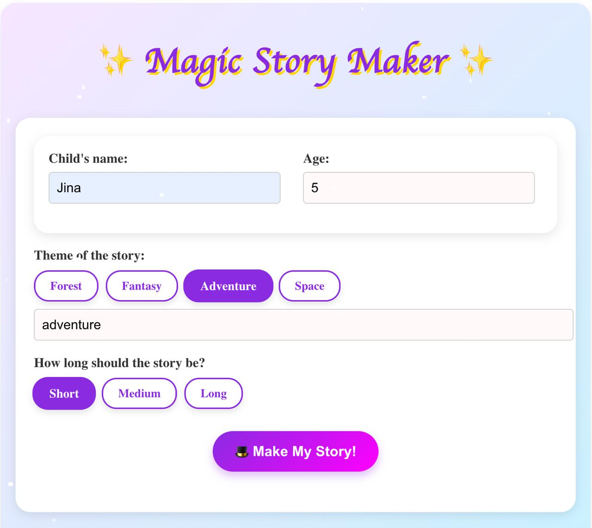
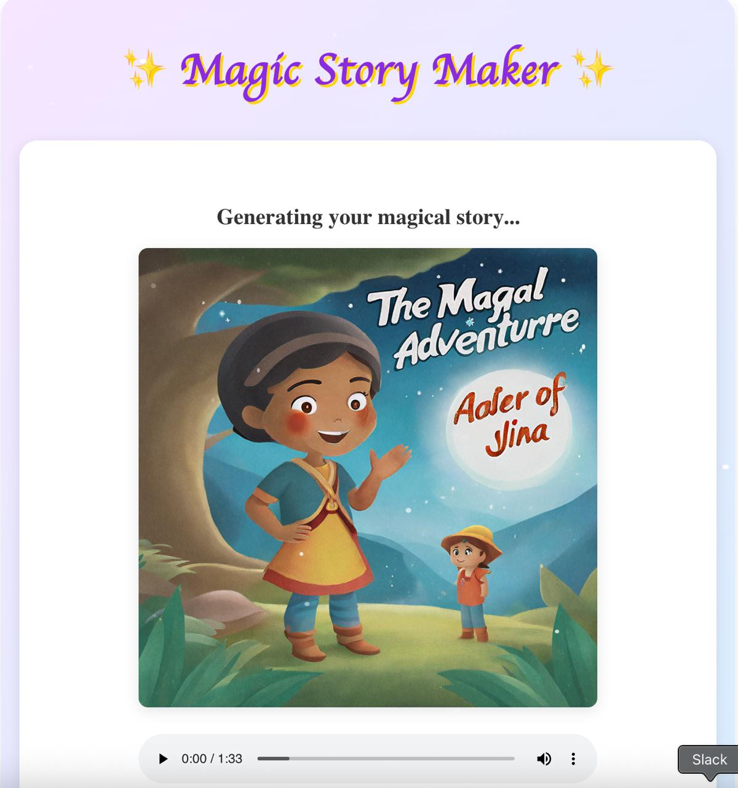

# Story Teller App

## Overview
The Story Teller App is a React-based application designed to create and share bedtime stories for children. It leverages AI to generate unique stories, images, and audio narrations based on user inputs like child name and story theme. The app allows users to view classic stories and generate custom stories which can be viewed or listened to as audio.

## Features
- **Story Generation**: Generate custom bedtime stories using AI.
- **Image Generation**: Create child-friendly illustrations for stories.
- **Audio Narration**: Convert story text to audio for playback.
- **Story Viewing**: View both classic and generated stories within the app.

## Screenshots
<details>
<summary>Click to view screenshots</summary>




</details>

## Setup Instructions

### Prerequisites
- Node.js and npm for frontend and CDK deployment.
- AWS CLI configured with appropriate credentials.
- AWS CDK installed (see installation steps below).
- AWS Bedrock model IDs for text and image generation:
  - `anthropic.claude-3-haiku-20240307-v1:0`
  - `amazon.titan-image-generator-v2:0`

#### Installing AWS CDK
1. **Install Node.js and npm**:
   If you don't already have Node.js and npm installed, download and install them from [nodejs.org](https://nodejs.org/).
   Verify the installation by running:
   ```bash
   node --version
   npm --version
   ```
2. **Install AWS CDK Toolkit**:
   Use npm to install the AWS CDK Toolkit globally:
   ```bash
   npm install -g aws-cdk
   ```
3. **Verify CDK Installation**:
   Check if CDK is installed correctly by running:
   ```bash
   cdk --version
   ```
   You should see the CDK version number if the installation was successful.
4. **Configure AWS Credentials**:
   Ensure your AWS credentials are set up correctly. You can configure them using the AWS CLI:
   ```bash
   aws configure
   ```
   Enter your Access Key ID, Secret Access Key, region, and output format as prompted.

   Or just export your Access Key ID, Secret Access Key and Session token (if exists)

      ```bash
   export AWS_ACCESS_KEY_ID="ABCDEF"
   export AWS_SECRET_ACCESS_KEY="ABCDEF"
   export AWS_SESSION_TOKEN="ABCDEF"
   ```
### Installation and Deployment
1. **Clone the Repository**:
   ```bash
   git clone <repository-url>
   cd ai-story-teller-app
   ```
2. **Install Dependencies**:
   - For the backend (CDK and Lambdas):
     ```bash
     npm install
     ```
3. **Deploy the Backend**:
   - Bootstrap CDK if not already done:
     ```bash
     cdk bootstrap
     ```
   - Deploy the stack:
     ```bash
     cdk deploy
     ```
   This will create necessary AWS resources like S3 buckets, DynamoDB tables, Lambda functions, and API Gateway.
4. **You will get Outputs, for example**:

    ```bash
    StoryTellerAppStack.BackendApiEndpoint94865037 = https://hvb5j2i5e3.execute-api.us-east-1.amazonaws.com/prod/
    StoryTellerAppStack.FrontendURL = https://d5fjlh4ri9e4w.cloudfront.net
    StoryTellerAppStack.StorageBucketName = storytellerappstack-storytellerbucket2ca39022-5lnuulgca9nz
    ```
    Create frontend/.env file, using these outputs. Edit only `REACT_APP_BACKEND_API_URL`,`REACT_APP_STORAGE_BUCKET` and `REACT_APP_FRONTEND_URL`. For example:
    ```
    REACT_APP_BACKEND_API_URL=https://hvb5j2i5e3.execute-api.us-east-1.amazonaws.com/prod/
    REACT_APP_STORAGE_BUCKET=storytellerappstack-storytellerbucket2ca39022-5lnuulgca9nz
    REACT_APP_FRONTEND_URL=https://d5fjlh4ri9e4w.cloudfront.net
    REACT_APP_STORY_GENERATOR_URL=${REACT_APP_BACKEND_API_URL}story
    REACT_APP_IMAGE_GENERATOR_URL=${REACT_APP_BACKEND_API_URL}image
    REACT_APP_PRESIGNED_URL=${REACT_APP_BACKEND_API_URL}url
    REACT_APP_STORY_METADATA_URL=${REACT_APP_BACKEND_API_URL}metadata
    ```
   - For the frontend:
     ```bash
     cd frontend
     npm install && npm run build
     ```
   - And deploy the frontend by running again:
     ```bash
     cd ../
     cdk deploy
     ```


## AWS Services Involved
- **Amazon S3**: Stores story texts, generated images, and audio files.
- **Amazon DynamoDB**: Database for storing story metadata.
- **AWS Lambda**: Handles story generation, image creation, audio synthesis, and metadata retrieval.
- **Amazon API Gateway**: Provides REST endpoints for frontend interaction.
- **Amazon SNS**: Manages event notifications between services (e.g., S3 events triggering Lambda functions).
- **Amazon Bedrock**: Utilizes AI models for story and image generation.
- **Amazon Polly**: Converts text to speech for audio narration.

## Project Structure
- `frontend/`: React application for the user interface.
- `lambda/`: Serverless functions for various backend tasks.
- `lib/`: CDK stack definition for infrastructure.

## Troubleshooting
- Ensure AWS credentials are correctly configured.
- Check CloudWatch logs for Lambda errors if story generation or media processing fails.
- Verify environment variables in both frontend and Lambda configurations.

## Contributing
Feel free to fork this repository, make changes, and submit pull requests for enhancements or bug fixes.
